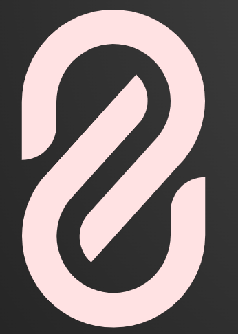

<div id="top"></div>

[![Contributors][contributors-shield]][contributors-url]
[![Forks][forks-shield]][forks-url]
[![Stargazers][stars-shield]][stars-url]
[![Issues][issues-shield]][issues-url]
[![LinkedIn][linkedin-shield]][linkedin-url]


<!-- PROJECT LOGO -->
<br />
<div align="center">
  <a href="https://github.com/KDTEC/RepoSniffer">
    
  </a>

<h3 align="center">RepoSniffer</h3>

  <p align="center">
    Say goodbye to the hassle of cloning repositories. 🙌 With RepoSniffer, save time, dive into code instantly!  🌐🕵️‍♂️. Wait!, there's more to it, it also provides the feature of 1-click deployment directly from your repository.
    <br />
    <a href="https://github.com/KDTEC/RepoSniffer"><strong>Explore the docs »</strong></a>
    <br />
    <br />
    <a href="https://github.com/KDTEC/RepoSniffer">View Demo</a>
    ·
    <a href="https://github.com/KDTEC/RepoSniffer/issues">Report Bug</a>
  </p>
</div>

<br>

<!-- ABOUT THE PROJECT -->
## About The Project

[![Product Name Screen Shot][product-screenshot]](https://example.com)

This is the homepage of the application.

### System design of the deployment module

[![System Design of the deployment module][system-design-deployment]](https://example.com)

This module contains following services:

- `api-server`: HTTP API Server for REST API's
- `build-server`: Docker Image code which clones, builds and pushes the code (after building it) to S3
- `s3-reverse-proxy`: Reverse Proxy the subdomains and domains to s3 bucket static assets


<p align="right">(<a href="#top">back to top</a>)</p>


### Built With

* [ReactJS](https://react.dev/) - For the UI
* [NodeJS](https://nodejs.org/en) - For the backend module
* [AWS (ECR & ECS)](https://aws.amazon.com/) - For containerization
* [Redis](https://redis.io/) - To PUBSUB the deployment logs to redis

<p align="right">(<a href="#top">back to top</a>)</p>


<!-- GETTING STARTED -->
## Getting Started

This is an example of how you may give instructions on setting up your project locally.
To get a local copy up and running follow these simple example steps.

### Local Setup

- Fork and clone the Repo

#### For the frontend module

1. Installing dependencies:

```bash
yarn install
```

Or

```
npm install
```
2. Start the Development Mode:

```bash
yarn run dev
```

or if you installed dependencies using `npm` use below command

```
npm run dev
```
It runs the app in development mode. Open [http://localhost:5173](http://localhost:5173) to view it in your browser.

The page will reload when you make changes.

#### For the backend module

1. Run `npm install` in all the 3 services i.e. `api-server`, `build-server` and `s3-reverse-proxy`
2. Docker build the `build-server` and push the image to AWS ECR.
3. Setup the `api-server` by providing all the required config such as TASK ARN and CLUSTER arn.
4. Run `node index.js` in `api-server` and `s3-reverse-proxy`
5. Create a .env file in the repository folder with following parameters
   - AWS credentials can be obtained from the [AWS console](https://aws.amazon.com/)
   - For Redis I have used [Aiven](https://aiven.io/)
   ```env
   AWS_ACCESS_KEY_ID=''
   AWS_SECRET_ACCESS_KEY=''
   REDIS_URL=''
   ```

At this point following services would be up and running:

| S.No | Service            | PORT    |
| ---- | ------------------ | ------- |
| 1    | `api-server`       | `:9000` |
| 2    | `socket.io-server` | `:9001` |
| 3    | `s3-reverse-proxy` | `:8000` |

<p align="right">(<a href="#top">back to top</a>)</p>

<!-- CONTACT -->
## Contact

Kshitij Dhawan - kshitij.formal@gmail.com

Project Link: [https://repo-sniffer.netlify.app](https://repo-sniffer.netlify.app)

<p align="right">(<a href="#top">back to top</a>)</p>


<!-- MARKDOWN LINKS & IMAGES -->
<!-- https://www.markdownguide.org/basic-syntax/#reference-style-links -->
[contributors-shield]: https://img.shields.io/github/contributors/KDTEC/RepoSniffer.svg?style=for-the-badge
[contributors-url]: https://github.com/KDTEC/RepoSniffer/graphs/contributors
[forks-shield]: https://img.shields.io/github/forks/KDTEC/RepoSniffer.svg?style=for-the-badge
[forks-url]: https://github.com/KDTEC/RepoSniffer/network/members
[stars-shield]: https://img.shields.io/github/stars/KDTEC/RepoSniffer.svg?style=for-the-badge
[stars-url]: https://github.com/KDTEC/RepoSniffer/stargazers
[issues-shield]: https://img.shields.io/github/issues/KDTEC/RepoSniffer.svg?style=for-the-badge
[issues-url]: https://github.com/KDTEC/RepoSniffer/issues
[linkedin-shield]: https://img.shields.io/badge/-LinkedIn-black.svg?style=for-the-badge&logo=linkedin&colorB=555
[linkedin-url]: https://linkedin.com/in/KDTEC
[product-screenshot]: pics/homepage.png
[system-design-deployment]: pics/sys-design-deploy.png
